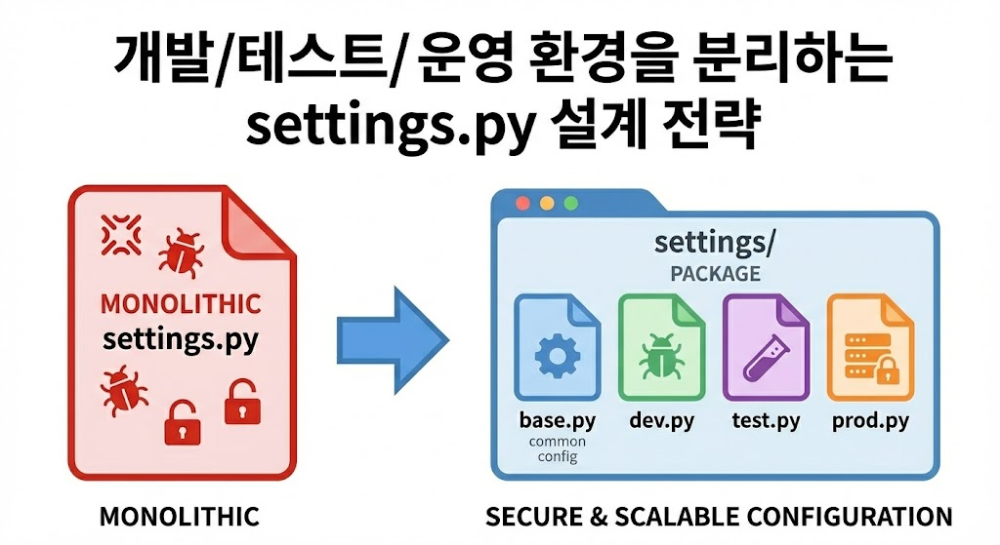

# 개발/테스트/운영 환경을 분리하는 settings.py 설계 전략

> 하나의 settings.py 파일로 모든 환경을 관리하면 보안 문제, 설정 충돌, 협업 어려움이 발생하므로, settings 패키지 구조로 환경별 설정을 분리해야 함



## 환경 분리가 필요한 이유

- **보안 문제**: 운영 서버의 DB 비밀번호, SECRET_KEY 등 민감 정보가 Git에 노출
- **설정 충돌**: 개발 환경의 DEBUG=True가 운영 환경에 배포되면 보안 취약점 발생
- **협업 어려움**: 팀원마다 다른 로컬 환경으로 인한 설정 충돌 발생

## settings 패키지 구조 설계

기존 `settings.py` 파일을 `settings` 디렉토리로 분리:

```
myproject/settings/
├── __init__.py
├── base.py    # 공통 설정
├── dev.py     # 개발 환경 설정  
├── test.py    # 테스트 환경 설정
└── prod.py    # 운영 환경 설정
```

## 환경별 설정 파일 구성

### base.py 작성
- 모든 환경에서 공통으로 사용되는 설정 정의
- INSTALLED_APPS, MIDDLEWARE, TEMPLATES 등 포함
- 민감 정보는 환경 변수로 처리

### dev.py 작성
- base.py의 모든 설정을 상속받아 개발용 설정으로 덮어씀
- DEBUG = True, ALLOWED_HOSTS = ['*'] 설정
- SQLite3 등 간단한 DB 설정 사용

### prod.py 작성
- base.py를 상속받아 운영 환경용 설정으로 덮어씀
- DEBUG = False, 실제 서비스 도메인 설정
- PostgreSQL 등 운영 DB 설정 (환경 변수 사용)

## 설정 파일 적용 방법

### 환경 변수 사용 (권장)
```bash
export DJANGO_SETTINGS_MODULE="myproject.settings.dev"
```

### manage.py 실행 시 옵션 사용
```bash
python manage.py runserver --settings=myproject.settings.dev
```

## 주요 주의사항

- **SECRET_KEY 보안**: 절대 코드에 하드코딩하지 말고 환경 변수 사용
- **운영 환경 DEBUG**: 반드시 DEBUG = False로 설정
- **민감 정보 관리**: DB 비밀번호 등은 환경 변수로 분리 관리