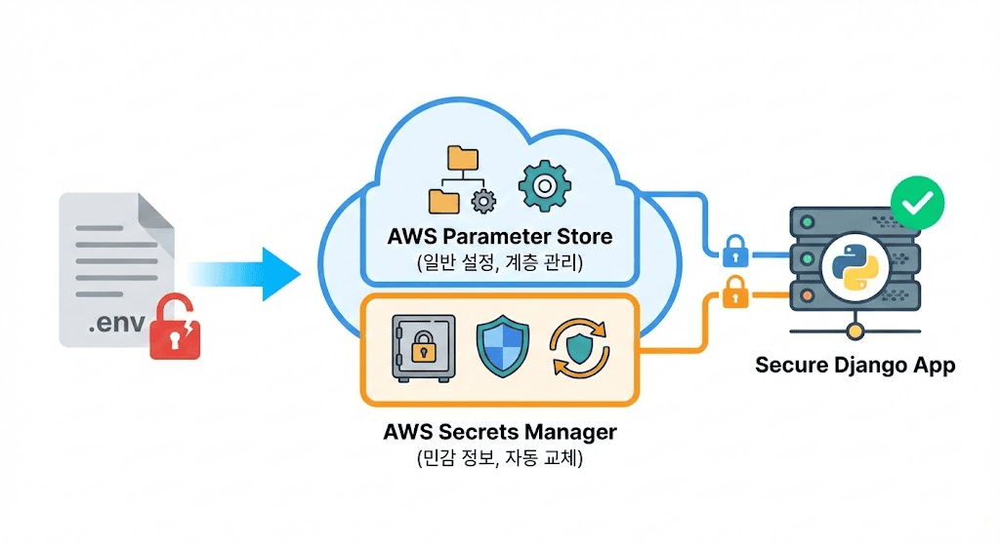

# AWS Parameter Store, Secrets Manager를 이용한 환경 변수 관리

> .env 파일의 한계를 넘어 AWS Parameter Store와 Secrets Manager를 활용해 Django 프로젝트의 환경 변수를 안전하고 확장 가능하게 관리하는 방법

## .env 파일의 한계점

- **보안 위험**: .env 파일이 실수로 Git 저장소에 업로드되거나 서버에서 탈취될 위험 존재
- **관리의 어려움**: 환경별로 다른 .env 파일을 관리하고 동기화하는 과정에서 실수 발생 가능
- **권한 제어의 한계**: 특정 개발자에게 세분화된 권한 제어 불가능
- **감사 추적의 부재**: 누가 언제 중요한 설정값을 변경했는지 추적 어려움

## AWS Parameter Store vs Secrets Manager

### Parameter Store
- **용도**: 일반 설정 값, DB 연결 문자열, API 키 등
- **보안**: AWS KMS를 통한 암호화 (SecureString)
- **가격**: Standard 등급은 월 10,000개의 API 요청까지 무료
- **특징**: 계층 구조, 버전 관리, IAM 연동, Standard(4KB)/Advanced(8KB) 등급

### Secrets Manager
- **용도**: 데이터베이스 자격 증명, API 키 등 매우 민감한 정보
- **보안**: AWS KMS를 통한 암호화 (기본)
- **가격**: Secret 당 월 $0.40 + API 호출 비용
- **특징**: 자동 암호 키 교체(RDS, DocumentDB 등 기본 지원), 교차 계정 접근

## AWS 서비스 설정

### 파라미터 및 보안 암호 생성
- **이름 규칙**: `/{프로젝트명}/{환경}/{설정명}` 형태로 계층적 구조 사용
- **Parameter Store**: SecureString 타입으로 암호화하여 저장
- **Secrets Manager**: 키/값 페어 형태로 민감 정보 저장

### IAM 권한 설정
- **최소 권한 원칙**: 필요한 리소스에만 접근 허용
- **IAM Role 사용**: Access Key를 하드코딩하지 말고 EC2나 ECS Task에 IAM Role 부여
- **필요 권한**: `ssm:GetParameter`, `ssm:GetParameters`, `secretsmanager:GetSecretValue`, `kms:Decrypt`

## Django 연동 구현

### boto3 클라이언트 설정
- `boto3` 라이브러리를 사용해 AWS 서비스와 연동
- `@lru_cache`를 활용해 API 호출 최소화 및 성능 최적화
- `GetParameters` API로 여러 파라미터 배치 처리 권장
- AWS 환경 여부를 판단해 로컬과 클라우드 환경 분기 처리

### settings.py 분기 처리
- **AWS 환경**: Parameter Store와 Secrets Manager에서 설정값 로드
- **로컬 환경**: 기존 .env 파일 사용
- 환경별로 적절한 설정 소스 자동 선택

## 실무 활용 팁

### 혼용 전략
- **일반 설정**: Parameter Store 사용 (비용 절약)
- **민감 정보**: Secrets Manager 사용 (보안 강화)

### 캐싱의 중요성
- settings.py는 애플리케이션 시작 시 한 번만 실행
- API 요청마다 AWS 호출하는 구조 방지
- `@lru_cache`로 동일 파라미터 요청 캐싱

### Secrets Rotation 활용
- RDS, DocumentDB 등은 자동 교체 기본 지원 (커스텀 Lambda 필요한 경우도 있음)
- 30일, 90일 등 주기적 교체로 보안 수준 향상
- 다운타임 없이 자동 반영