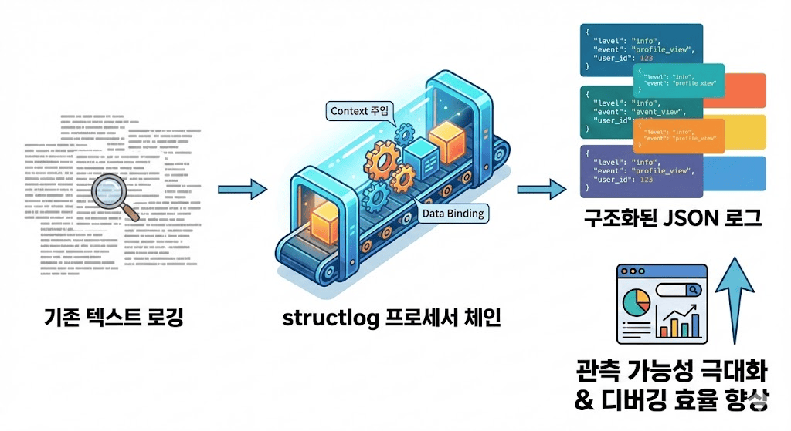

# structlog로 구축하는 실무형 구조화 로깅

> Django 프로젝트의 관측 가능성을 극대화하고 디버깅 효율을 향상시키는 구조화 로깅 시스템을 structlog로 구축하는 방법



## 구조화 로깅이 필요한 이유

기존 텍스트 기반 로깅의 한계점을 해결하기 위해 Key-Value 형태의 JSON 구조로 로그를 기록하는 방식으로, 검색과 필터링이 용이하고 로그 분석 시스템과의 연동이 원활함

## structlog 핵심 개념

프로세서 체인을 통해 로그 이벤트가 생성되고 최종 출력되기까지의 각 처리 단계를 정의하며, 각 프로세서는 로그 정보를 추가, 제거, 변경하는 역할을 담당

## Django 프로젝트 설정

### 설치 및 기본 설정

```bash
pip install structlog
```

### settings.py 설정

Django의 LOGGING 설정과 structlog 설정을 함께 구성하여 개발 환경에서는 콘솔 로그를, 운영 환경에서는 JSON 로그를 출력하도록 설정

### 실제 코드에서 사용

```python
import structlog

logger = structlog.get_logger(__name__)

def view_function(request):
    log = logger.bind(user_id=request.user.id)
    log.info("프로필 조회 시작")
    # ...
```

## 자동 컨텍스트 주입

Django 미들웨어를 활용하여 모든 HTTP 요청에 request_id, user_id, ip_address 등의 공통 정보를 자동으로 바인딩하여 로그 추적을 용이하게 함

## 실무 팁

- 민감 정보 로깅 금지
- 적절한 로그 레벨 전략 수립 (DEBUG, INFO, WARNING, ERROR, CRITICAL)
- 일관된 Key 이름 사용
- 운영 환경에서는 반드시 JSONRenderer 사용으로 성능 최적화