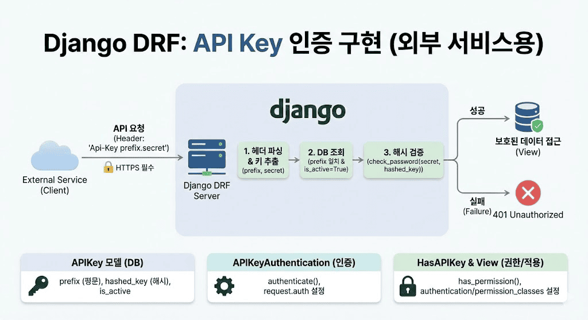

# Django DRF: 외부 서비스를 위한 API Key 인증 방식 구현

> 외부 서비스나 서드파티 클라이언트가 안전하게 API를 호출할 수 있도록 하는 API Key 기반 인증 시스템 구현



## API Key 인증이 필요한 이유

- JWT나 세션 인증은 주로 사용자 신원 확인용
- 서버 대 서버 통신에서는 API Key가 적합
- 파트너사 서버, 외부 모니터링 시스템, 모바일 앱 백엔드 등에서 사용

## APIKey 모델 설계

```python
class APIKey(models.Model):
    prefix = models.CharField(max_length=8, unique=True, editable=False)
    hashed_key = models.CharField(max_length=128, editable=False)
    service = models.CharField(max_length=100, help_text="키를 사용하는 서비스 이름")
    created = models.DateTimeField(auto_now_add=True, db_index=True)
    is_active = models.BooleanField(default=True)

    def set_key(self, key: str):
        from django.contrib.auth.hashers import make_password
        self.hashed_key = make_password(key)

    def check_key(self, key: str) -> bool:
        from django.contrib.auth.hashers import check_password
        return check_password(key, self.hashed_key)
```

**핵심 포인트:**
- API Key는 평문 저장 금지, 해시값으로 저장
- prefix와 key를 분리하여 관리
- is_active 필드로 소프트 삭제 구현

## 커스텀 인증 클래스 구현

```python
from rest_framework.authentication import BaseAuthentication
from rest_framework.exceptions import AuthenticationFailed

class APIKeyAuthentication(BaseAuthentication):
    keyword = 'Api-Key'

    def authenticate(self, request):
        auth_header = request.headers.get('Authorization')
        
        if not auth_header:
            return None
            
        try:
            keyword, key = auth_header.split()
        except ValueError:
            return None
            
        if keyword.lower() != self.keyword.lower():
            return None
            
        api_key = self._authenticate_credentials(key)
        return (None, api_key)

    def _authenticate_credentials(self, key: str):
        try:
            prefix, secret_key = key.split('.')
        except ValueError:
            raise AuthenticationFailed("잘못된 API Key 형식")
            
        try:
            api_key = APIKey.objects.get(prefix=prefix, is_active=True)
        except APIKey.DoesNotExist:
            raise AuthenticationFailed("유효하지 않은 API Key")

        if not api_key.check_key(secret_key):
            raise AuthenticationFailed("유효하지 않은 API Key")
        
        return api_key
```

## 권한 클래스 구현

```python
from rest_framework.permissions import BasePermission

class HasAPIKey(BasePermission):
    message = "유효한 API Key가 필요함"

    def has_permission(self, request, view):
        return isinstance(request.auth, APIKey)
```

## View에 적용

```python
from rest_framework.views import APIView
from rest_framework.response import Response

class ProtectedDataView(APIView):
    authentication_classes = [APIKeyAuthentication]
    permission_classes = [HasAPIKey]

    def get(self, request):
        service_name = request.auth.service
        return Response({
            "message": f"'{service_name}' 서비스 접근 성공",
            "data": ["보호된 데이터"]
        })
```

## 실무 고려사항

- **HTTPS 필수**: API Key는 평문으로 전송되므로 반드시 HTTPS 사용
- **키 교체 기능**: 주기적 키 재발급 및 이전 키 비활성화 기능 구현
- **세분화된 권한**: API Key별로 접근 가능한 범위를 다르게 설정
- **여러 인증 방식 동시 지원**: JWT, 세션 인증과 함께 사용 가능