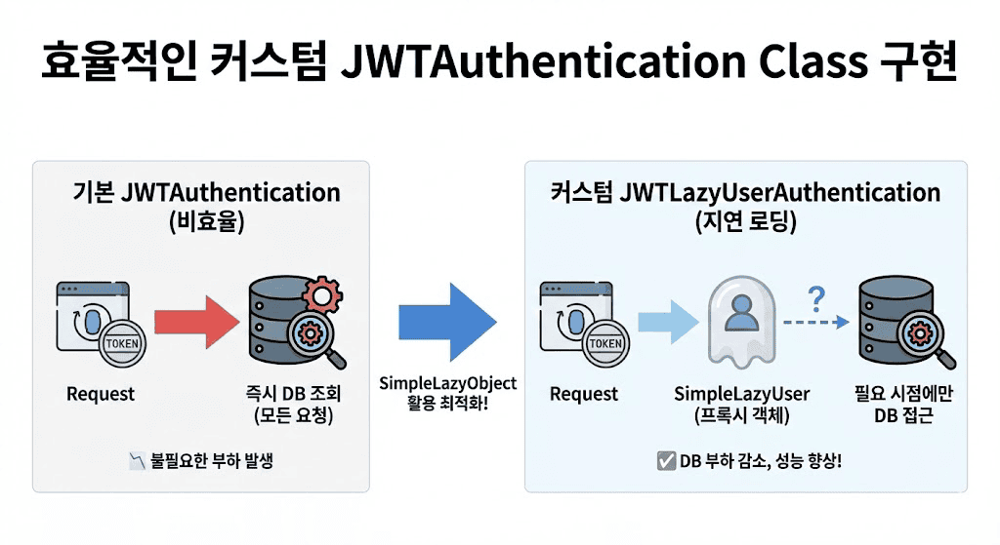

# 효율적인 커스텀 JWTAuthentication Class 구현

> 기본 JWTAuthentication은 모든 인증 요청마다 DB에서 사용자 정보를 조회하지만, SimpleLazyObject를 활용한 지연 로딩으로 실제 사용자 정보가 필요한 시점에만 DB 접근하도록 최적화



## 기본 JWTAuthentication의 문제점

- 모든 인증된 요청마다 데이터베이스에서 사용자 정보 조회
- View나 Serializer에서 `request.user` 객체 정보가 불필요한 경우에도 DB 조회 발생
- 불필요한 DB 부하로 인한 성능 저하

## SimpleLazyObject 활용

- Django의 지연 로딩 유틸리티로 프록시 객체 역할
- 생성 시점에는 실행하지 않고 객체의 속성 접근 시점에 실제 함수 실행
- `request.user` 생성 시 DB 조회 없이, 실제 데이터 필요 시점에만 DB 조회

## 커스텀 구현 코드

```python
from django.utils.functional import SimpleLazyObject
from django.utils.translation import gettext_lazy as _
from rest_framework_simplejwt import exceptions
from rest_framework_simplejwt.authentication import JWTAuthentication
from rest_framework_simplejwt.settings import api_settings


class SimpleLazyUser(SimpleLazyObject):
    @property
    def is_authenticated(self):
        """인증 여부: 토큰 인증 시 인증된 사용자로 판단"""
        return True

    def __bool__(self):
        """사용자 존재: Permission 에서 사용자 인증 여부 확인"""
        return True


class JWTLazyUserAuthentication(JWTAuthentication):
    """
    JWT 사용자 지연 인증
    - 토큰 검증을 통해 인증을 진행
    - 데이터베이스에 저장된 사용자 정보는 실제 데이터가 사용되는 곳에서 지연 로딩
    """

    def get_active_user(self, user_id):
        """지연 로딩: 사용자 조회 및 활성화 여부 확인"""
        try:
            user = self.user_model.objects.get(**{api_settings.USER_ID_FIELD: user_id})
        except self.user_model.DoesNotExist:
            raise exceptions.AuthenticationFailed(
                _("User not found"), code="user_not_found"
            )
        if api_settings.CHECK_USER_IS_ACTIVE and not user.is_active:
            raise exceptions.AuthenticationFailed(
                _("User is inactive"), code="user_inactive"
            )
        return user

    def get_user(self, validated_token):
        """토큰을 이용한 사용자 조회"""
        try:
            user_id = validated_token[api_settings.USER_ID_CLAIM]
        except KeyError:
            raise exceptions.InvalidToken(
                _("Token contained no recognizable user identification")
            )
        return SimpleLazyUser(lambda: self.get_active_user(user_id))
```

## 코드 구현 핵심

**SimpleLazyUser 클래스**
- `is_authenticated` 속성을 항상 True로 반환하여 권한 체크 시 DB 조회 방지
- `__bool__` 메서드를 True로 고정하여 Permission에서 사용자 존재 여부 확인 시 DB 조회 방지

**JWTLazyUserAuthentication 클래스**
- `get_user()` 메서드 오버라이딩: 기존 즉시 DB 조회 로직을 SimpleLazyUser 프록시 객체 반환으로 변경
- `get_active_user()` 메서드 분리: 실제 DB 조회와 사용자 활성 상태 검증 로직을 독립적인 메서드로 구현
- 람다 함수 `lambda: self.get_active_user(user_id)`로 지연 실행 함수를 SimpleLazyUser에 전달

## 성능 개선 효과

- `request.user` 정보 불필요한 API: DB 조회 1회 → 0회
- `request.user` 정보 필요한 API: DB 조회 1회 → 1회 (동일하지만 로직상 이점)
- 대규모 서비스에서 서버 부하 감소와 성능 향상

## 실무 적용 가이드

**효과적인 사용 시나리오**
- MSA 환경에서 서비스 간 내부 인증
- 조회 요청이 많고 사용자별 데이터가 포함되지 않는 API
- API 게이트웨이에서 단순 인증 여부 확인

**주의사항**
- 에러 발생 시점이 인증 단계에서 View/Serializer 로직 내부로 변경
- 디버깅 시 `request.user`가 프록시 객체로 표시될 수 있음
- 타입 힌트와 IDE 자동완성을 위해 `typing.cast` 활용 권장