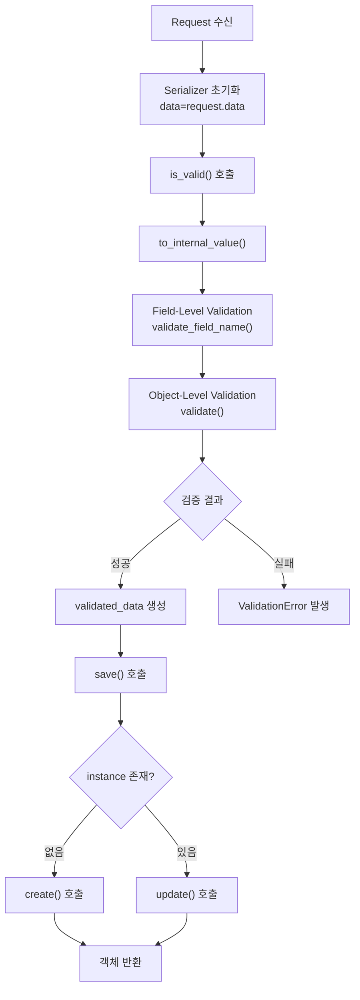
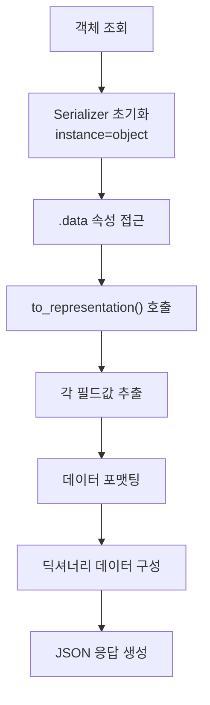

# Serializer의 내부 동작 흐름: 데이터 입력부터 출력까지

> DRF Serializer의 역직렬화(입력→검증→저장)와 직렬화(객체→출력) 과정의 내부 동작 메커니즘과 각 단계별 메서드의 호출 시점 및 커스터마이징 방법

## Serializer의 두 가지 핵심 역할

**직렬화 (Serialization)**  
Python 객체(Django 모델 인스턴스, 쿼리셋)를 딕셔너리 형태의 원시 데이터로 변환하여 JSON 응답으로 전달

**역직렬화 (Deserialization)**  
외부 요청 데이터를 검증하고 Python 객체로 변환하여 새로운 객체 생성 또는 기존 객체 수정

## 역직렬화 흐름: 입력부터 저장까지

**1. Serializer 초기화**
- 생성 시: `ArticleSerializer(data=request.data)`
- 수정 시: `ArticleSerializer(instance=article, data=request.data)`
- 컨텍스트 전달: `context={'request': self.request}`

**2. 유효성 검사 (`is_valid()`)**
- `to_internal_value()`: 원시 데이터를 Python 네이티브 데이터 타입으로 변환
- 필드 레벨 검증: `validate_<field_name>()` 메서드 실행
- 객체 레벨 검증: `validate()` 메서드로 필드 간 관계 검증

**3. 데이터 접근**
- `validated_data`: 검증 통과한 깨끗한 데이터
- `errors`: 검증 실패 시 에러 정보

**4. 객체 저장 (`save()`)**
- `create(validated_data)`: instance 없이 초기화된 경우 새 객체 생성
- `update(instance, validated_data)`: instance와 함께 초기화된 경우 기존 객체 수정

## 직렬화 흐름: 객체부터 출력까지

**1. Serializer 초기화**
- 단일 객체: `ArticleSerializer(instance=article)`
- 여러 객체: `ArticleSerializer(instance=articles, many=True)`

**2. 데이터 접근 (`.data`)**
속성 접근 시 직렬화 프로세스 시작, 결과는 캐싱

**3. `to_representation()` 호출**
모델 instance를 딕셔너리 형태로 변환하여 최종 출력 데이터 구성

## 핵심 메서드별 사용 목적

**`to_internal_value(data)`**: 입력 데이터 파싱/변환  
**`validate_<field>(value)`**: 단일 필드 유효성 검사  
**`validate(data)`**: 여러 필드 간 관계 검증  
**`create(validated_data)`**: 새 객체 생성 로직 커스텀  
**`update(instance, validated_data)`**: 기존 객체 수정 로직 커스텀  
**`to_representation(instance)`**: 출력 데이터 형태 커스텀