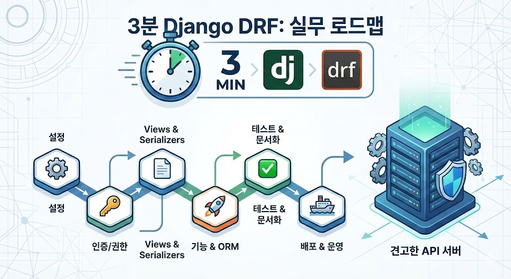

# 3분 Django DRF: 쉽고 빠른 실무 가이드

> Django REST Framework를 활용해 실무에서 마주하는 다양한 문제를 해결하고, 높은 수준의 API 서버 개발에 필요한 핵심 기술을 다루는 실전 가이드

## 🎯 이 강의가 특별한 이유

**3분으로 끝나는 실전 강의**
- 각 강의는 3분 내외로 구성되어 필요한 부분만 선택하여 빠르게 학습 가능
- 이론보다는 실무에서 바로 적용할 수 있는 패턴과 해결책 중심

**실무 경험에서 나온 노하우**
- 단순 기능 구현을 넘어 안정적이고 확장 가능한 API 서버 구축 방법
- 클린 API 설계 7대 원칙(예측 가능성, 명확성, 효율성, 보안성, 유지보수성, 신뢰성, 개발자 경험)을 체득
- 함께 일하고 싶은 동료로 성장하는 것이 목표

**13개 섹션, 100+ 실전 주제**
- 프로젝트 설정부터 배포까지 전 과정 커버
- 인증/권한, Views, Serializers, ORM 최적화, 테스팅, 성능 튜닝 등 실무 핵심 영역
- 각 주제마다 "왜 이렇게 해야 하는가"를 명확히 설명

## 📚 커리큘럼

### 1. 강의 소개
Django DRF를 배워야 하는 이유와 이 강의에서 무엇을 배울 수 있는지

### 2. 프로젝트 설정
환경 분리, 보안 설정, 로깅, 커스텀 유저 모델 등 견고한 기반 구축

### 3. 인증 및 권한
JWT, API Key, 객체 레벨 권한 등 다양한 인증/권한 시스템 구현

### 4. Views & Viewsets
ViewSet 내부 동작 이해, APIView vs ViewSet 선택 기준, 커스텀 CRUD 로직

### 5. Serializers
성능 최적화, 중첩 객체 처리, 읽기/쓰기 필드 분리 등 고급 활용법

### 6. API 기능 구현
페이지네이션, 필터링, 정렬, Throttling, 버저닝, 파일 업로드, WebSocket

### 7. Models(ORM)
N+1 문제 해결, 동적 쿼리, 대량 데이터 처리, 쿼리 최적화

### 8. API 문서화
drf-spectacular로 자동 문서 생성 및 커스터마이징

### 9. 성능 최적화
캐싱, 스트리밍, Connection Pooling, 비동기 View, Raw Query

### 10. 테스팅
APITestCase, factory-boy, Mock, 부하 테스트, 테스트 커버리지 전략

### 11. 배포 및 운영
Docker, CI/CD, 모니터링(Sentry, Prometheus), 무중단 배포

### 12. 유틸 및 실무 팁
Celery, Signals, 커스텀 미들웨어, GraphQL 연동

### 13. 마치며
강의 요약 및 클린 API 설계 원칙, 추가 학습 로드맵

## 👥 이 강의가 필요한 분

- ✅ DRF 경험이 있지만 성능 최적화와 고급 기능을 배우고 싶은 개발자
- ✅ 다른 프레임워크 경험은 있지만 DRF를 빠르게 습득하고 싶은 개발자
- ✅ 실무에서 안정적이고 확장 가능한 API 서버를 구축하고 싶은 개발자
- ✅ 체계적인 개발 방법론을 익혀 함께 일하고 싶은 동료로 성장하고 싶은 개발자

## 🚀 시작하기

왼쪽 메뉴에서 원하는 섹션을 선택하여 학습을 시작하세요. 각 강의는 독립적으로 학습할 수 있도록 구성되어 있어 필요한 부분만 골라서 볼 수 있습니다.

---

**문의**: [lee@lou2.kr](mailto:lee@lou2.kr)  
**사이트**: [https://django-tutorial.lou2.kr](https://django-tutorial.lou2.kr)
