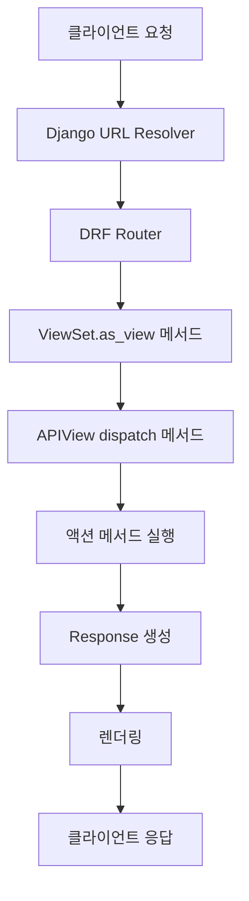

# ViewSet의 내부 동작 흐름: Router부터 Response까지

> DRF ViewSet이 클라이언트 요청을 받아 처리하고 응답을 생성하는 전체 과정을 단계별로 설명

## 전체 흐름 개요

## Router: URL과 ViewSet 연결

- `router.register()`가 ViewSet을 분석하여 URL 패턴을 자동 생성
- HTTP 메서드와 ViewSet 액션 메서드를 매핑
- 예: `GET /users/1/` → `retrieve` 액션, `POST /users/` → `create` 액션

## as_view(): ViewSet을 Django View로 변환

- Django URL Dispatcher는 함수 형태의 View가 필요하지만 ViewSet은 클래스
- `as_view()`가 HTTP 메서드-액션 매핑을 기반으로 새로운 View 함수를 동적 생성
- 내부적으로 `UserViewSet.as_view({'get': 'retrieve', 'put': 'update'})` 형태로 동작

## dispatch(): APIView의 핵심 처리 과정

요청-응답 사이클을 관장하는 핵심 메서드로 다음 단계를 순차 실행:

1. **initialize_request**: Django HttpRequest를 DRF Request 객체로 래핑
2. **perform_authentication**: authentication_classes를 통한 사용자 인증
3. **check_permissions**: permission_classes를 통한 권한 검사
4. **check_throttles**: throttle_classes를 통한 요청량 제어

모든 검사를 통과해야 액션 메서드 호출

## 액션 메서드 실행

ModelViewSet의 경우 mixins에서 제공하는 기본 구현 사용:

1. **get_object()**: URL pk 값으로 객체 조회
2. **get_serializer()**: 시리얼라이저 인스턴스 생성
3. **Response()**: 직렬화된 데이터를 Response 객체로 반환

## 렌더링과 최종 응답

- Content Negotiation: 클라이언트 Accept 헤더 확인
- Renderer를 통해 데이터를 요청된 포맷(JSON 등)으로 변환
- Django HttpResponse 객체 생성하여 클라이언트에 전달

## 실무 팁

- `self.action` 속성으로 현재 실행 중인 액션 확인 가능
- 액션 메서드 직접 오버라이드보다는 헬퍼 메서드(`get_queryset`, `get_serializer_class` 등) 오버라이드 권장
- 인증/권한 오류는 대부분 dispatch 단계에서 발생
- `@action` 데코레이터로 커스텀 엔드포인트 추가 가능