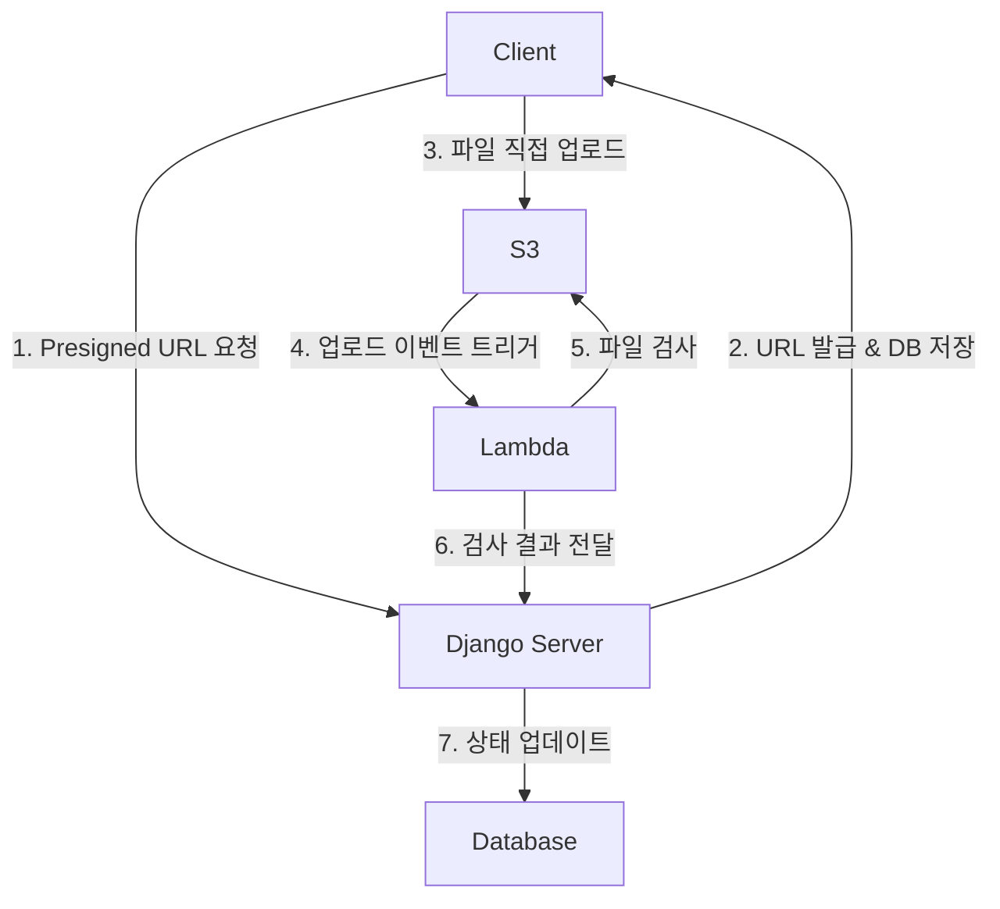

# 대용량 파일 업로드 처리와 S3 연동, 그리고 보안 고려사항

> 클라이언트가 Presigned URL을 통해 S3에 직접 업로드하고, Lambda로 파일을 검증하여 서버 부하를 최소화하면서 안전한 파일 관리를 구현하는 방법

## 기존 서버 업로드 방식의 한계

- **서버 리소스 과부하**: 대용량 파일 처리 시 CPU, 메모리 집중 사용으로 다른 API 성능 저하
- **확장성 문제**: 동시 업로드 증가 시 서버 인스턴스 확장만으로는 해결 한계
- **타임아웃 위험**: 대용량 파일 업로드 중 연결 끊김 및 업로드 실패 빈발
- **후처리 부담**: 파일 검증, 변환 작업으로 인한 응답 지연

## S3 Presigned URL + Lambda 아키텍처

## 구현 단계

### 1. Presigned URL 생성 및 파일 정보 사전 저장
- boto3로 Presigned URL 생성
- 파일 메타데이터를 데이터베이스에 사전 저장 (상태: 업로드 준비중)
- ContentType을 활용한 다양한 객체 연결 지원
- 만료 시간 설정으로 보안 강화

### 2. 클라이언트 직접 업로드
- 발급받은 Presigned URL로 S3에 파일 직접 업로드
- 서버 요청 시와 동일한 파일만 업로드 가능 (후처리에서 검증)

### 3. Lambda 트리거 기반 파일 검증
- S3 업로드 완료 이벤트로 Lambda 자동 실행
- 악성 코드 스캔, 파일 타입 검증 등 보안 검사 수행
- 파일 무결성 확인 (용량, 타입, 해시값 등)

### 4. 검증 결과 반영
- Lambda에서 서버로 검증 결과 전달
- 파일 정보 불일치 시 상태를 '실패'로 변경
- 검증 통과 시 상태를 '업로드 완료'로 변경하여 다운로드 허용

## 주요 장점

- **서버 리소스 절약**: 파일 데이터가 서버를 거치지 않아 메모리, CPU 사용량 대폭 감소
- **확장성 향상**: 대용량 파일 업로드가 서버 성능에 미치는 영향 최소화
- **안전한 상태 관리**: Lambda를 통한 자동화된 파일 검증 및 상태 업데이트
- **유연한 파일 관리**: 스케줄러를 통한 만료 파일 자동 정리 가능

## 보안 및 관리 요소

- **Presigned URL 만료 시간**: 짧은 유효 시간으로 URL 탈취 위험 최소화
- **파일 무결성 검증**: 업로드 요청 파일과 실제 업로드 파일 일치 확인
- **악성 코드 스캔**: Lambda에서 자동화된 보안 검사 수행
- **ContentType 활용**: 다양한 모델과의 유연한 파일 연결 지원

## 실무 적용 고려사항

- **기존 서버 업로드 대비**: 스트리밍 방식 등으로 리소스를 절약해도 파일 검증 과정에서 CPU/메모리 사용 불가피
- **API 성능 보호**: 파일 처리로 인한 다른 API 영향 방지 가능
- **대용량 파일 필수**: 자주 대용량 파일을 다루는 서비스에서는 필수적 아키텍처